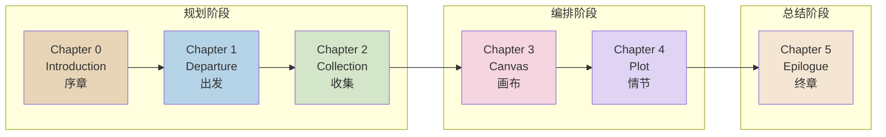
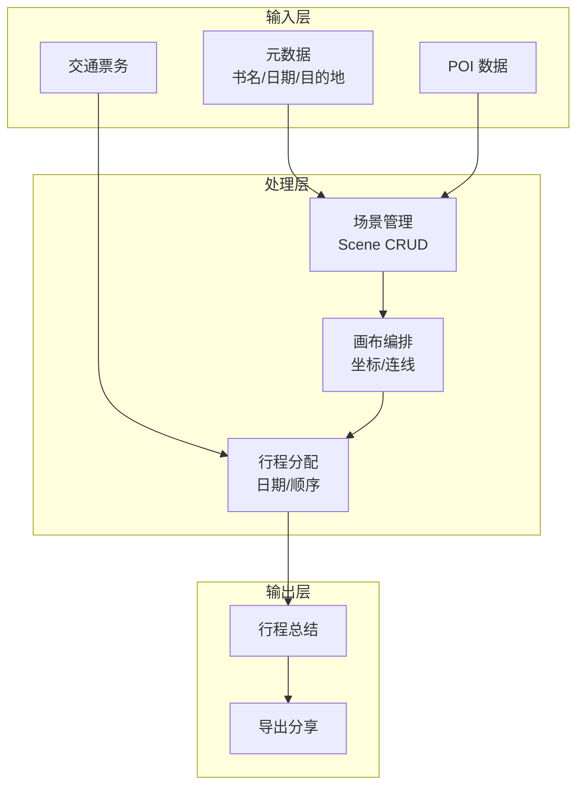
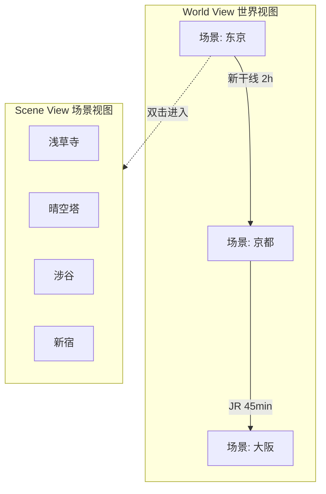
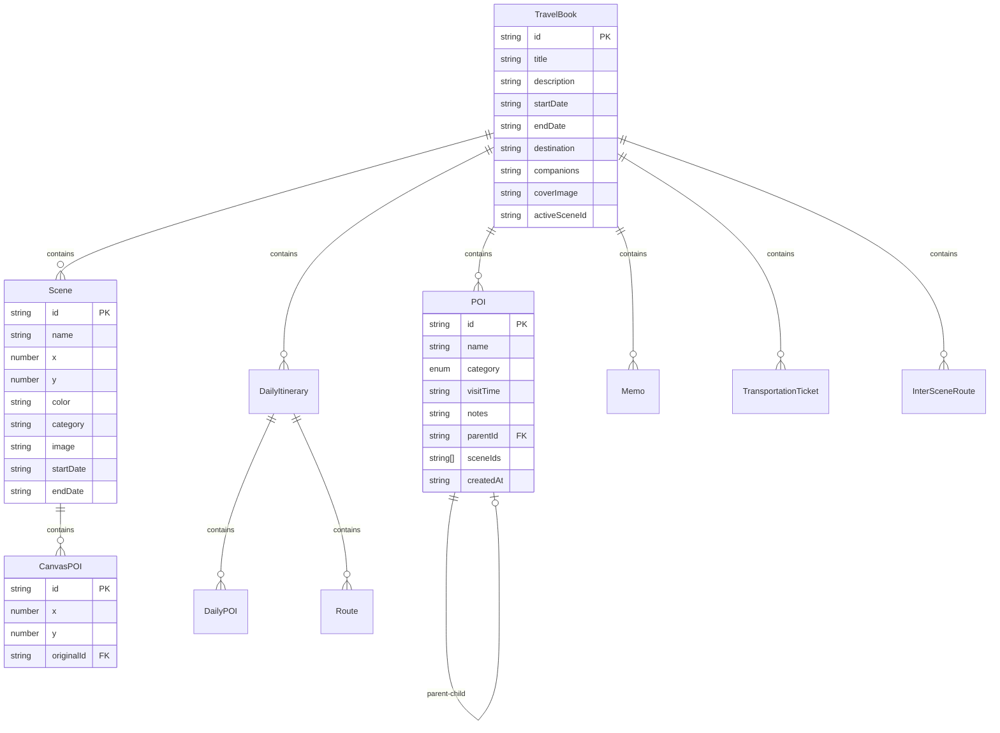
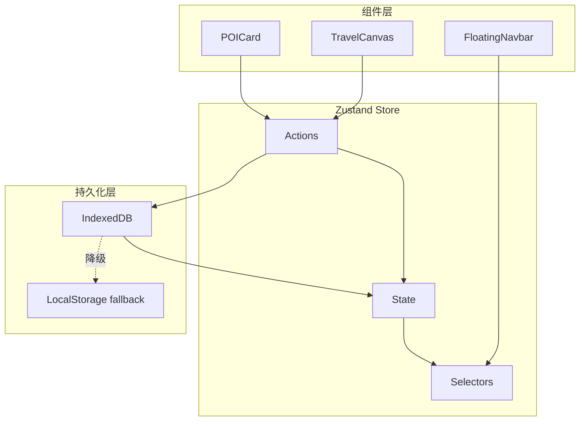
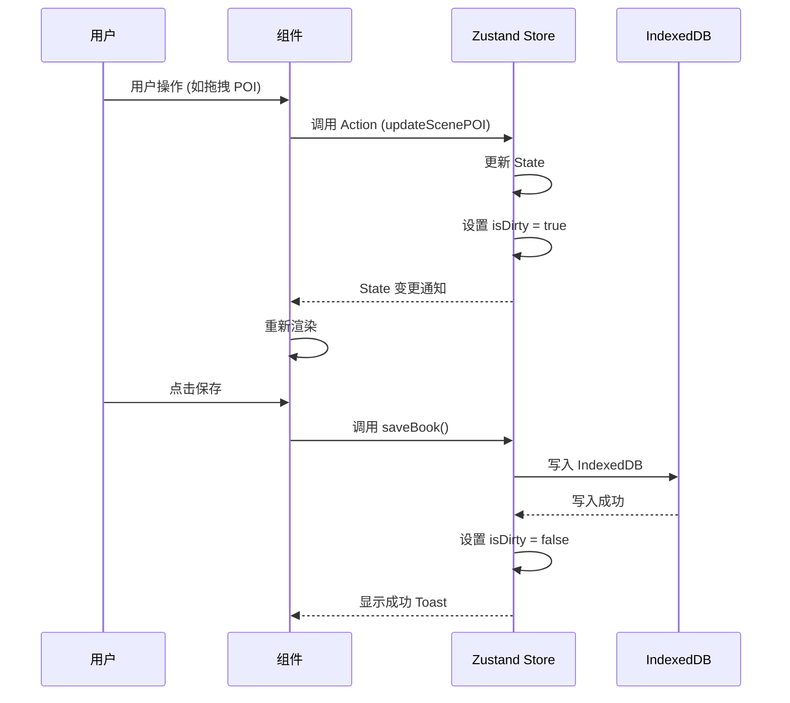

# TravelBook 产品需求文档 (PRD)

| 项目名称 | TravelBook (旅行书) | 文档状态 | V3.1 (定稿) |
| :--- | :--- | :--- | :--- |
| **文档作者** | Antigravity | **最后更新** | 2026-01-15 |
| **适用平台** | Web (Mobile/Desktop Responsive) | **密级** | 内部公开 |

---

## 目录

1. [文档变更记录](#1-文档变更记录-version-history)
2. [产品概述](#2-产品概述-executive-summary)
3. [用户画像与使用场景](#3-用户画像与使用场景-user-personas--scenarios)
4. [信息架构](#4-信息架构-information-architecture)
5. [功能需求说明](#5-功能需求说明-functional-requirements)
6. [数据模型设计](#6-数据模型设计-data-model)
7. [非功能需求](#7-非功能需求-non-functional-requirements)
8. [UI/UX 设计规范](#8-uiux-设计规范-design-guidelines)
9. [技术架构](#9-技术架构-technical-architecture)
10. [埋点需求](#10-埋点需求-analytics-requirements)
11. [开放问题与风险](#11-开放问题与风险-open-issues--risks)
12. [附录](#12-附录-appendix)

---

## 1. 文档变更记录 (Version History)

| 版本 | 日期 | 修改人 | 修改内容 | 备注 |
| :--- | :--- | :--- | :--- | :--- |
| V1.0 | 2026-01-01 | Team | 初始版本 | 基础功能定义 |
| V2.0 | 2026-01-13 | Antigravity | 架构重构 | 增加世界视图、场景管理、规范化非功能需求 |
| V2.1 | 2026-01-14 | Antigravity | 功能增强 | Canvas 页面支持父子 POI 关系；Plot 页面支持多场景切换 |
| V3.0 | 2026-01-14 | Antigravity | 文档完善 | 全面完善 PRD，增加详细的数据模型、技术架构、用户旅程等 |
| V3.1 | 2026-01-15 | Antigravity | **后端集成** | 新增 Supabase 后端、用户认证、云端同步功能 |

---

## 2. 产品概述 (Executive Summary)

### 2.1 项目背景

当前的旅行规划工具往往存在以下问题：

- **碎片化严重**：用户需在地图应用、笔记软件、预订平台之间反复切换
- **缺乏叙事感**：传统工具以列表或表格为主，无法呈现旅行的"故事感"
- **数据隐私担忧**：云端存储带来数据泄露风险，用户缺乏完全控制权
- **学习成本高**：专业软件功能复杂，普通用户难以上手

TravelBook 旨在提供一个**沉浸式、线性叙事与非线性探索相结合**的规划体验，将旅行规划过程转化为创作一本"书"的过程。

### 2.2 产品愿景 (Vision Statement)

> **"Every trip is a story. Where will you go next?"**
> 
> 每一次旅行都是一个故事。让用户像创作一本书一样规划旅程，从序章到终章，完整记录从灵感萌发到旅程完结的全过程。

### 2.3 核心价值主张 (Value Proposition)

| 价值维度 | 描述 | 竞品对比优势 |
| :--- | :--- | :--- |
| **结构化叙事** | 通过"章节"概念引导用户完成从灵感到结案的完整规划流 | 区别于碎片化的笔记工具 |
| **可视化编排** | 提供基于画布 (Canvas) 的自由拖拽与场景 (Scene) 管理 | 优于传统表格式行程规划 |
| **本地优先** | 数据完全存储于本地 IndexedDB，保护隐私无需网络服务 | 区别于强制云端同步的应用 |
| **高颜值体验** | 玻璃态 (Glassmorphism) 设计语言，流畅动效 | 超越功能导向的工具软件 |

### 2.4 成功指标 (Success Metrics)

#### 北极星指标 (North Star Metric)
- **旅行书完成率**：用户完成一本"旅行书"并在 Epilogue 页面生成总结的比率

#### 核心业务指标

| 指标类别 | 指标名称 | 目标值 | 计算方式 |
| :--- | :--- | :--- | :--- |
| **活跃度** | 平均单次会话时长 | ≥ 15 分钟 | 从进入应用到关闭的平均时间 |
| **功能使用** | Canvas 页面交互次数 | ≥ 10 次/会话 | 拖拽、连线、缩放的总操作次数 |
| **功能使用** | 多场景功能使用率 | ≥ 40% | 创建 2 个及以上场景的用户比例 |
| **留存** | 7 日留存率 | ≥ 30% | 7 天后回访用户占比 |
| **完成度** | POI 至行程转化率 | ≥ 60% | 被分配到 Plot 的 POI 占总 POI 比例 |

### 2.5 目标用户群

- **主要用户**：18-45 岁，具有自由行经验的旅行爱好者
- **次要用户**：旅行博主、行程规划师、需要协助规划的家庭用户

---

## 3. 用户画像与使用场景 (User Personas & Scenarios)

### 3.1 用户画像

#### P1: 指挥官型旅行者 (The Master Planner) - 主要用户

```
姓名：张明 | 年龄：32岁 | 职业：项目经理
```

| 维度 | 描述 |
| :--- | :--- |
| **特征** | 喜欢掌控一切细节，追求行程的高效衔接，时间观念强 |
| **行为习惯** | 出行前做详细攻略，精确到每小时；喜欢使用 Excel 规划 |
| **痛点** | 现有工具难以直观展示多天行程的空间关系；难以处理复杂的城市间交通 |
| **需求** | 需要精确的时刻表 (Plot 页面)、清晰的路线图以及待办事项清单 |
| **期望** | "我希望所有行程一目了然，任何变动都能快速调整" |

#### P2: 体验派探索者 (The Experience Seeker) - 主要用户

```
姓名：李晓 | 年龄：27岁 | 职业：设计师
```

| 维度 | 描述 |
| :--- | :--- |
| **特征** | 关注旅行的氛围感，规划较为随性，重视视觉体验和灵感收集 |
| **行为习惯** | 喜欢在小红书、Pinterest 收集图片；规划时更看重"感觉对不对" |
| **痛点** | 传统的表格/列表式规划工具太枯燥，缺乏视觉刺激 |
| **需求** | 高颜值的界面、拖拽式的自由画布、图文并茂的 POI 卡片 |
| **期望** | "规划本身就是旅行的一部分，我希望这个过程是愉快的" |

#### P3: 随性派漫游者 (The Casual Wanderer) - 次要用户

```
姓名：王芳 | 年龄：45岁 | 职业：教师
```

| 维度 | 描述 |
| :--- | :--- |
| **特征** | 技术不熟练，更喜欢简单直观的操作，常与家人同行 |
| **行为习惯** | 参考旅行社行程，希望有现成模板可用 |
| **痛点** | 专业软件学习成本高，不知道从何开始 |
| **需求** | 简洁的引导流程、清晰的章节划分、一键式操作 |
| **期望** | "最好有模板让我参考，然后简单改改就行" |

### 3.2 典型使用场景 (User Scenarios)

#### 场景 1：多城市蜜月旅行规划

```
用户：P1 张明（与妻子计划 10 天意大利蜜月游）
```

**用户旅程**：
1. 创建旅行书，设置"意大利蜜月之旅"、日期范围
2. 在 Departure 页面添加往返机票信息
3. 在 Collection 页面收集罗马、佛罗伦萨、威尼斯的景点和餐厅
4. 在 Canvas 的 World View 创建 3 个城市场景，添加城市间交通连线
5. 分别进入每个城市的 Scene View，规划具体 POI 布局
6. 在 Plot 页面按天分配行程，调整访问顺序

**关键功能使用**：
- 多场景管理
- 城市间交通连线
- 每日行程排序

#### 场景 2：周末 City Walk 灵感收集

```
用户：P2 李晓（周末上海 City Walk）
```

**用户旅程**：
1. 快速创建旅行书
2. 在 Collection 页面将小红书上看到的咖啡店、画廊、买手店录入
3. 在 Canvas 上随意拖拽 POI，形成视觉化的路线图
4. 无需严格安排时间，保持灵活

**关键功能使用**：
- POI 快速录入
- Canvas 自由拖拽
- 低门槛使用

#### 场景 3：家庭亲子游规划

```
用户：P3 王芳（带孩子去东京迪士尼）
```

**用户旅程**：
1. 创建旅行书
2. 在 Collection 添加迪士尼的游乐设施，利用**父子关系**将项目归类到园区
3. 在 Canvas 看到清晰的园区-项目层级关系
4. 在 Plot 页面为两天的行程分别安排项目

**关键功能使用**：
- POI 父子层级关系
- 基于层级的可视化

---

## 4. 信息架构 (Information Architecture)

### 4.1 章节结构 (Chapter Structure)

TravelBook 采用**书籍隐喻**作为核心交互模型，将旅行规划流程抽象为 6 个章节：



### 4.2 页面导航结构

```
/                           # 首页（欢迎页）
├── /library                # 书架（旅行书列表）
└── /[book-context]         # 书本上下文
    ├── /introduction       # Chapter 0
    ├── /departure          # Chapter 1
    ├── /collection         # Chapter 2
    ├── /canvas             # Chapter 3
    │   ├── World View      # 世界视图（多场景管理）
    │   └── Scene View      # 场景视图（单场景 POI 编排）
    ├── /plot               # Chapter 4
    └── /epilogue           # Chapter 5
```

### 4.3 数据流向



---

## 5. 功能需求说明 (Functional Requirements)

### 5.1 优先级定义

| 优先级 | 定义 | 交付要求 |
| :--- | :--- | :--- |
| **P0 (Must-have)** | 核心功能，缺失导致产品不可用 | MVP 必须包含 |
| **P1 (Should-have)** | 重要功能，缺失影响体验完整性 | 首次正式发布需包含 |
| **P2 (Nice-to-have)** | 锦上添花的功能 | 后续迭代 |

### 5.2 核心流程：章节导航系统 (Chapter Navigation)

| 属性 | 值 |
| :--- | :--- |
| **优先级** | P0 |
| **入口** | 浮动胶囊导航栏 (FloatingNavbar) |

#### 功能描述

用户通过浮动胶囊导航栏在 6 个规划章节间切换，支持线性推进和非线性跳转。

#### 功能点

| 功能点 | 描述 | 优先级 |
| :--- | :--- | :--- |
| 章节跳转 | 支持 0-5 六个章节的线性或非线性跳转 | P0 |
| 未保存拦截 | 当检测到 `isDirty` 状态时，必须弹窗阻断跳转，提示保存或丢弃 | P0 |
| 当前章节高亮 | 当前所在章节需有视觉区分（高亮状态） | P0 |
| 返回书架 | 提供快速返回 Library 页面的入口 | P0 |

#### 验收标准 (Acceptance Criteria)

- [ ] AC1：用户可通过点击导航项跳转至任意章节
- [ ] AC2：当存在未保存数据时，跳转被拦截并显示确认弹窗
- [ ] AC3：确认弹窗提供"保存并离开"、"不保存离开"、"取消"三个选项
- [ ] AC4：当前章节的导航项具有视觉区分度

---

### 5.3 Chapter 0: Introduction (序章)

| 属性 | 值 |
| :--- | :--- |
| **优先级** | P0 |
| **路由** | `/introduction` |
| **核心目的** | 录入旅行书的元数据，建立旅程身份 |

#### 功能点

| 功能点 | 描述 | 必填 | 优先级 |
| :--- | :--- | :--- | :--- |
| 书名输入 | 旅行书的标题 | ✅ | P0 |
| 目的地输入 | 主要目的地名称 | ✅ | P0 |
| 日期范围选择 | 旅程的开始和结束日期 | ✅ | P0 |
| 同伴信息 | 同行人员描述 | ❌ | P1 |
| 旅程简介 | 旅行的描述或期望 | ❌ | P1 |
| 封面图片上传 | 支持上传本地图片作为封面 | ❌ | P1 |
| 图片压缩 | 上传图片自动压缩至 < 1MB | - | P0 |

#### 表单验证规则

| 字段 | 验证规则 | 错误提示 |
| :--- | :--- | :--- |
| 书名 | 非空，长度 1-50 字符 | "请输入书名" / "书名过长" |
| 目的地 | 非空，长度 1-100 字符 | "请输入目的地" |
| 开始日期 | 非空，有效日期格式 | "请选择开始日期" |
| 结束日期 | 非空，≥ 开始日期 | "结束日期不能早于开始日期" |

#### 验收标准

- [ ] AC1：必填字段为空时，保存按钮禁用或显示验证错误
- [ ] AC2：封面图片上传后展示预览，并自动压缩
- [ ] AC3：日期范围选择器正确处理跨月/跨年场景

---

### 5.4 Chapter 1: Departure (出发)

| 属性 | 值 |
| :--- | :--- |
| **优先级** | P1 |
| **路由** | `/departure` |
| **核心目的** | 管理出发与返程的大交通信息 |

#### 功能点

| 功能点 | 描述 | 优先级 |
| :--- | :--- | :--- |
| 交通类型选择 | 支持 飞机/火车/大巴/自驾/其他 | P1 |
| 票务信息录入 | 航班号/车次、时间、座位等级 | P1 |
| 多段行程 | 支持添加多段大交通（转机/中转） | P2 |
| 出发/到达地点 | 记录出发地和目的地 | P1 |
| 价格记录 | 记录票价信息 | P2 |
| 备注 | 自由记录注意事项 | P2 |

#### 票务数据结构

| 字段 | 类型 | 说明 |
| :--- | :--- | :--- |
| id | string | 唯一标识 |
| type | enum | flight / train / bus / car / other |
| provider | string | 航空公司/铁路运营商 |
| ticketNumber | string | 票号/订单号 |
| departureLocation | string | 出发地 |
| arrivalLocation | string | 到达地 |
| departureDate | string | 出发日期 |
| departureTime | string | 出发时间 |
| arrivalDate | string | 到达日期 |
| arrivalTime | string | 到达时间 |
| price | string | 价格 |
| class | string | 舱位等级 |
| notes | string | 备注 |

---

### 5.5 Chapter 2: Collection (收集) - 灵感库

| 属性 | 值 |
| :--- | :--- |
| **优先级** | P0 |
| **路由** | `/collection` |
| **核心目的** | 收集和管理所有兴趣点 (POI) |

#### 功能点

| 功能点 | 描述 | 优先级 |
| :--- | :--- | :--- |
| POI 创建 | 创建兴趣点，填写名称、分类、计划访问时间等 | P0 |
| POI 编辑 | 编辑已有 POI 的所有属性 | P0 |
| POI 删除 | 删除 POI，需确认弹窗 | P0 |
| 分类筛选 | 按 POI 分类过滤列表 | P0 |
| 名称搜索 | 按名称关键词搜索 POI | P1 |
| 父子关系设置 | 定义 POI 的层级关系（如：主题公园 → 游乐设施） | P1 |
| 批量导入 | (未来) 从外部数据源批量导入 POI | P2 |

#### POI 分类定义

| 分类 | 英文标识 | 图标建议 | 说明 |
| :--- | :--- | :--- | :--- |
| 住宿 | accommodation | 🏨 | 酒店、民宿、青旅等 |
| 景点 | sightseeing | 🏛️ | 观光景点、地标建筑 |
| 美食 | food | 🍜 | 餐厅、小吃、咖啡店 |
| 购物 | shopping | 🛍️ | 商场、市集、特产店 |
| 交通 | transportation | 🚗 | 交通枢纽、租车点 |
| 其他 | other | 📍 | 其他类型的兴趣点 |

#### POI 数据结构

| 字段 | 类型 | 必填 | 说明 |
| :--- | :--- | :--- | :--- |
| id | string | ✅ | 唯一标识 (nanoid 生成) |
| name | string | ✅ | POI 名称 |
| category | POICategory | ✅ | 分类枚举 |
| visitTime | string | ✅ | 计划访问时间 |
| notes | string | ❌ | 备注信息 |
| parentId | string | ❌ | 父级 POI 的 ID |
| sceneIds | string[] | ❌ | 所属场景 ID 列表 |
| createdAt | string | ✅ | 创建时间 ISO 格式 |

---

### 5.6 Chapter 3: Canvas (画布) - 核心可视化

| 属性 | 值 |
| :--- | :--- |
| **优先级** | P0 |
| **路由** | `/canvas` |
| **核心目的** | 可视化编排 POI 与场景间的空间关系 |

#### 5.6.1 双视图模式

Canvas 页面采用**双视图架构**，支持宏观与微观两个层级的编排：

| 视图 | 名称 | 功能 |
| :--- | :--- | :--- |
| **World View** | 世界视图 | 管理多个城市/目的地场景，定义场景间交通连线 |
| **Scene View** | 场景视图 | 单一场景内的 POI 自由拖拽与布局 |



#### 5.6.2 World View 功能点

| 功能点 | 描述 | 优先级 |
| :--- | :--- | :--- |
| 场景创建 | 通过悬浮按钮创建新场景 | P0 |
| 场景编辑 | 编辑场景名称、颜色、日期范围 | P0 |
| 场景删除 | 删除场景及其所有 POI | P0 |
| 场景拖拽 | 在画布上自由拖拽场景位置 | P0 |
| 场景间连线 | 定义场景间的交通路线 | P1 |
| 交通信息录入 | 为连线添加交通方式、时间、价格 | P1 |
| 场景进入 | 双击场景节点进入 Scene View | P0 |

#### 5.6.3 Scene View 功能点

| 功能点 | 描述 | 优先级 |
| :--- | :--- | :--- |
| POI 拖入 | 从侧边栏拖拽 POI 到画布 | P0 |
| POI 拖拽 | 在画布内自由拖拽 POI 位置 | P0 |
| POI 移除 | 从画布移除 POI（不删除原数据） | P0 |
| 父子关系连线 | 自动识别父子关系并绘制连线 | P1 |
| 父子关系无序添加 | 支持先添加子节点再添加父节点 | P1 |
| 选中高亮 | 选中 POI 时显示高亮效果 | P0 |
| 画布缩放 | 支持画布的缩放操作 | P2 |
| 画布平移 | 支持画布的平移操作 | P2 |

#### 5.6.4 Scene 数据结构

| 字段 | 类型 | 必填 | 说明 |
| :--- | :--- | :--- | :--- |
| id | string | ✅ | 唯一标识 |
| name | string | ✅ | 场景名称 |
| x | number | ✅ | 在 World View 中的 X 坐标 |
| y | number | ✅ | 在 World View 中的 Y 坐标 |
| color | string | ❌ | 场景主题色 |
| category | string | ❌ | 场景分类（城市/海滩/山区等） |
| image | string | ❌ | 场景封面图 |
| startDate | string | ❌ | 在该场景的开始日期 |
| endDate | string | ❌ | 在该场景的结束日期 |
| pois | CanvasPOI[] | ✅ | 场景内的 POI 列表 |

#### 5.6.5 InterSceneRoute 数据结构

| 字段 | 类型 | 必填 | 说明 |
| :--- | :--- | :--- | :--- |
| id | string | ✅ | 唯一标识 |
| fromSceneId | string | ✅ | 起始场景 ID |
| toSceneId | string | ✅ | 目标场景 ID |
| transportType | enum | ✅ | flight/train/bus/car/ship |
| departureDateTime | string | ✅ | 出发时间 |
| arrivalDateTime | string | ✅ | 到达时间 |
| duration | string | ❌ | 行程时长 |
| price | string | ❌ | 价格 |
| details | string | ❌ | 详情（航班号等） |
| notes | string | ❌ | 备注 |

---

### 5.7 Chapter 4: Plot (情节) - 行程编排

| 属性 | 值 |
| :--- | :--- |
| **优先级** | P1 |
| **路由** | `/plot` |
| **核心目的** | 将 POI 分配至具体日期，编排每日行程顺序 |

#### 功能点

| 功能点 | 描述 | 优先级 |
| :--- | :--- | :--- |
| 每日容器 | 基于日期范围自动生成每日容器 | P0 |
| POI 选择 | 选择要分配到当日的 POI | P0 |
| **场景切换** | 在 POI 选择界面切换不同场景 | P1 |
| **跨场景累积** | 从不同场景选择的 POI 累积显示 | P1 |
| POI 排序 | 拖拽调整当日 POI 的访问顺序 | P0 |
| 交通添加 | 添加 POI 间的交通方式 | P1 |
| 交通时长 | 设置交通时间预估 | P1 |
| 移除分配 | 将 POI 从当日行程中移除 | P0 |

#### 交通方式枚举

| 交通方式 | 英文标识 | 图标 |
| :--- | :--- | :--- |
| 步行 | walk | 🚶 |
| 公交 | bus | 🚌 |
| 出租车 | taxi | 🚕 |
| 火车/地铁 | train | 🚃 |
| 自驾 | car | 🚗 |
| 骑行 | bike | 🚲 |

#### 每日行程数据结构

| 字段 | 类型 | 说明 |
| :--- | :--- | :--- |
| day | number | 第几天 (1-based) |
| selectedPoiIds | string[] | 选中的 POI ID 列表 |
| orderedPois | DailyPOI[] | 排序后的 POI 列表 |
| routes | Route[] | POI 间的交通路线 |

---

### 5.8 Chapter 5: Epilogue (终章) - 总结与分享

| 属性 | 值 |
| :--- | :--- |
| **优先级** | P2 |
| **路由** | `/epilogue` |
| **核心目的** | 生成旅程总结，支持导出与分享 |

#### 功能点

| 功能点 | 描述 | 优先级 |
| :--- | :--- | :--- |
| 行程统计 | 展示覆盖 POI 数量、行程天数等统计 | P2 |
| 场景旅程回顾 | 按场景展示行程概览 | P2 |
| 备忘录管理 | 创建/编辑/删除/置顶备忘录 | P1 |
| 导出 PDF | 通过浏览器打印功能导出 PDF | P2 |
| 生成分享链接 | 生成只读分享链接 | P2 |
| 复制到剪贴板 | 复制行程文本到剪贴板 | P2 |

#### 备忘录数据结构

| 字段 | 类型 | 说明 |
| :--- | :--- | :--- |
| id | string | 唯一标识 |
| title | string | 标题 |
| content | string | 内容 |
| date | string | 创建日期 |
| pinned | boolean | 是否置顶 |

---

## 6. 数据模型设计 (Data Model)

### 6.1 核心实体关系图



### 6.2 完整 TravelBook 数据结构

```typescript
interface TravelBook {
  // 标识与元数据
  id: string;                           // 唯一标识 (nanoid)
  title: string;                        // 书名
  description: string;                  // 描述
  destination?: string;                 // 主要目的地
  companions?: string;                  // 同伴信息
  coverImage?: string;                  // 封面图片 (Base64 或 URL)
  
  // 日期范围
  startDate: string;                    // 开始日期 (YYYY-MM-DD)
  endDate: string;                      // 结束日期 (YYYY-MM-DD)
  
  // 核心数据
  pois: POI[];                          // POI 源数据列表
  scenes: Scene[];                      // 场景列表
  activeSceneId: string;                // 当前激活的场景 ID
  sceneRoutes: InterSceneRoute[];       // 场景间交通路线
  
  // 行程数据
  dailyItineraries: DailyItinerary[];   // 每日行程列表
  
  // 辅助数据
  transportationTickets?: TransportationTicket[];  // 大交通票务
  memos: Memo[];                        // 备忘录
  
  // 兼容字段 (迁移用)
  canvasPois: CanvasPOI[];              // 旧版画布 POI (已迁移至 scene.pois)
}
```

### 6.3 状态管理 Store 结构

```typescript
interface TravelBookState {
  // 全局状态
  books: TravelBook[];                  // 所有旅行书列表
  currentBook: TravelBook | null;       // 当前正在编辑的旅行书
  currentBookSnapshot: TravelBook | null; // 用于变更检测的快照
  currentDay: number;                   // 当前编辑的天数 (Plot 页面)
  isLoading: boolean;                   // 加载状态
  error: string | null;                 // 错误信息
  isDirty: boolean;                     // 是否有未保存的更改
  
  // 场景相关
  sceneSwitchNotification: any | null;  // 场景切换通知
  sceneTemplates: SceneTemplate[];      // 场景模板列表
  
  // Actions (略，详见 Store 实现)
  // ...
}
```

---

## 7. 非功能需求 (Non-Functional Requirements)

### 7.1 数据隐私与存储 (Data & Privacy)

| 需求项 | 描述 | 验证标准 |
| :--- | :--- | :--- |
| **Local-First 架构** | 所有数据默认存储于客户端 IndexedDB | 断网后应用完全可用 |
| **存储限制** | 图片需经过 Canvas 压缩，确保单张图片 < 1MB | 图片上传后检查体积 |
| **总容量控制** | 总数据库体积控制在浏览器配额内 (通常 50MB+) | 超出配额时提示用户 |
| **降级机制** | 若环境不支持 IndexedDB（隐身模式），自动降级至 LocalStorage | 降级后显示容量警告 |
| **数据导出** | 用户可导出全部数据为 JSON 格式 | 导出文件可用于恢复 |

### 7.2 性能要求 (Performance)

| 指标 | 目标值 | 测量方式 |
| :--- | :--- | :--- |
| FCP (First Contentful Paint) | < 1.5s | Lighthouse |
| LCP (Largest Contentful Paint) | < 2.5s | Lighthouse |
| TTI (Time to Interactive) | < 3.5s | Lighthouse |
| Canvas 拖拽帧率 | ≥ 50fps | 性能监控工具 |
| 页面切换时间 | < 300ms | 用户感知 |

#### 性能优化策略

- **长列表虚拟化**：Collection 列表超过 50 项时启用虚拟滚动
- **画布节流**：Canvas 拖拽事件使用 `requestAnimationFrame` 节流
- **图片懒加载**：封面图片采用懒加载策略
- **代码分割**：各章节页面按需加载

### 7.3 国际化 (Localization)

| 需求项 | 描述 |
| :--- | :--- |
| **默认语言** | 英语 (en-US) |
| **支持语言** | 简体中文 (zh-CN) |
| **扩展性** | 所有 UI 文本必须通过 `i18n` 字典键值获取，不得硬编码 |
| **语言切换** | 用户可在应用内切换语言偏好 |

### 7.4 兼容性 (Compatibility)

#### 浏览器支持

| 浏览器 | 最低版本 | 测试状态 |
| :--- | :--- | :--- |
| Chrome | 90+ | 主要测试浏览器 |
| Safari | 15+ | 需测试 IndexedDB 兼容性 |
| Firefox | 90+ | 需测试 |
| Edge | 90+ | 基于 Chromium，预期兼容 |

#### 响应式断点

| 设备类型 | 宽度范围 | 布局特点 |
| :--- | :--- | :--- |
| Mobile | 375px - 767px | 单列布局，导航简化 |
| Tablet | 768px - 1023px | 双列布局 |
| Desktop | 1024px+ | 完整功能，多列布局 |
| Large Desktop | 1920px+ | 最大内容宽度限制 |

### 7.5 可访问性 (Accessibility)

| 需求项 | 描述 | 优先级 |
| :--- | :--- | :--- |
| 键盘导航 | 所有交互元素可通过键盘操作 | P1 |
| ARIA 标签 | 关键组件具备正确的 ARIA 属性 | P1 |
| 颜色对比度 | 文本与背景对比度符合 WCAG AA 标准 | P1 |
| 焦点指示 | 焦点状态有明确可见的视觉反馈 | P1 |

---

## 8. UI/UX 设计规范 (Design Guidelines)

### 8.1 设计语言：Ethereal Minimalism (空灵极简主义)

#### 核心关键词
- **通透** (Transparency)
- **流动** (Fluidity) 
- **呼吸感** (Breathing Space)

#### 视觉特征

| 特征 | 实现方式 | CSS 示例 |
| :--- | :--- | :--- |
| **Glassmorphism** | 大量使用背景模糊营造层级感 | `backdrop-filter: blur(12px)` |
| **半透明层** | 卡片/面板使用半透明白色背景 | `background: rgba(255, 255, 255, 0.7)` |
| **柔和边框** | 使用低透明度白色边框 | `border: 1px solid rgba(255, 255, 255, 0.4)` |
| **多层阴影** | 组合多层阴影增加层次 | `box-shadow: 0 4px 12px rgba(0,0,0,0.1), 0 2px 4px rgba(0,0,0,0.05)` |

### 8.2 字体规范

| 用途 | 字体 | 备用字体 | 说明 |
| :--- | :--- | :--- | :--- |
| **标题** | Playfair Display | Georgia, serif | 传递叙事感与优雅气质 |
| **正文** | Geist / Inter | system-ui, sans-serif | 现代、易读、跨平台 |
| **等宽** | Geist Mono | monospace | 代码、数字 |

#### 字号规范

| 级别 | 桌面端 | 移动端 | 用途 |
| :--- | :--- | :--- | :--- |
| H1 | 36px | 28px | 页面大标题 |
| H2 | 24px | 20px | 区块标题 |
| H3 | 18px | 16px | 卡片标题 |
| Body | 16px | 14px | 正文内容 |
| Small | 14px | 12px | 辅助信息 |

### 8.3 颜色系统

#### 主色板

| 名称 | 色值 | 用途 |
| :--- | :--- | :--- |
| Primary | `#8B5CF6` (Violet-500) | 主要操作、激活状态 |
| Primary Light | `#A78BFA` (Violet-400) | 悬停状态 |
| Primary Dark | `#7C3AED` (Violet-600) | 按下状态 |

#### 语义色板

| 名称 | 色值 | 用途 |
| :--- | :--- | :--- |
| Success | `#22C55E` (Green-500) | 成功提示 |
| Warning | `#F59E0B` (Amber-500) | 警告提示 |
| Error | `#EF4444` (Red-500) | 错误提示 |
| Info | `#3B82F6` (Blue-500) | 信息提示 |

#### 中性色板

| 名称 | 色值 | 用途 |
| :--- | :--- | :--- |
| Text Primary | `#1E293B` (Slate-800) | 主要文字 |
| Text Secondary | `#64748B` (Slate-500) | 次要文字 |
| Text Muted | `#94A3B8` (Slate-400) | 禁用/占位文字 |
| Background | `#F8FAFC` (Slate-50) | 页面背景 |
| Surface | `rgba(255, 255, 255, 0.7)` | 卡片背景 |

### 8.4 动效规范

#### 过渡时间

| 类型 | 时长 | 缓动函数 | 应用场景 |
| :--- | :--- | :--- | :--- |
| 快速 | 150ms | ease-out | 悬停效果、微交互 |
| 标准 | 300ms | ease-in-out | 页面切换、组件展开 |
| 慢速 | 500ms | ease | 复杂动画 |

#### 动效类型

| 类型 | 实现 | 用途 |
| :--- | :--- | :--- |
| 页面切换 | Framer Motion | 章节导航时的平滑过渡 |
| 组件动画 | CSS Transitions | 悬停、展开/折叠 |
| 呼吸动画 | CSS Keyframes | 激活状态的视觉反馈 |
| 拖拽反馈 | CSS Transform | Canvas 操作的实时反馈 |

### 8.5 交互原则

| 原则 | 说明 | 示例 |
| :--- | :--- | :--- |
| **直接操纵** | 能拖拽的绝不通过表单输入 | Canvas 上拖拽 POI 而非输入坐标 |
| **即时反馈** | 所有操作需有明确反馈 | 保存成功显示 Toast；拖拽时显示阴影 |
| **可逆操作** | 危险操作可撤销或需确认 | 删除 POI 前弹出确认框 |
| **状态可见** | 当前状态清晰可见 | isDirty 时导航标识提醒未保存 |
| **渐进披露** | 复杂功能按需展示 | 高级设置默认折叠 |

### 8.6 组件规范

#### 按钮尺寸

| 尺寸 | 高度 | 内边距 | 用途 |
| :--- | :--- | :--- | :--- |
| Small | 32px | px-3 | 紧凑空间 |
| Medium | 40px | px-4 | 默认 |
| Large | 48px | px-6 | 主要操作 |

#### 卡片规范

```css
/* 标准卡片样式 */
.card {
  background: rgba(255, 255, 255, 0.7);
  backdrop-filter: blur(8px);
  border-radius: 16px;
  border: 1px solid rgba(255, 255, 255, 0.4);
  box-shadow: 
    0 4px 12px rgba(0, 0, 0, 0.08),
    0 2px 4px rgba(0, 0, 0, 0.04);
}
```

---

## 9. 技术架构 (Technical Architecture)

### 9.1 技术栈

| 层级 | 技术 | 版本 | 说明 |
| :--- | :--- | :--- | :--- |
| **框架** | Next.js | 16.1.1 | React 全栈框架 |
| **UI 库** | React | 19.2.3 | 声明式 UI |
| **语言** | TypeScript | 5.x | 类型安全 |
| **状态管理** | Zustand | 5.0.9 | 轻量级状态管理 |
| **动画** | Framer Motion | 11.x | 声明式动画 |
| **样式** | Tailwind CSS | 3.x | 原子化 CSS |
| **存储** | IndexedDB | - | 本地持久化 |
| **ID 生成** | nanoid | 5.x | 唯一 ID 生成 |

### 9.2 项目结构

```
travelbook/
├── app/                        # Next.js App Router
│   ├── layout.tsx              # 根布局
│   ├── page.tsx                # 首页
│   ├── globals.css             # 全局样式
│   ├── library/                # 书架页面
│   ├── introduction/           # Chapter 0
│   ├── departure/              # Chapter 1
│   ├── collection/             # Chapter 2
│   ├── canvas/                 # Chapter 3
│   ├── plot/                   # Chapter 4
│   └── epilogue/               # Chapter 5
├── components/                 # 可复用组件
│   ├── FloatingNavbar.tsx      # 浮动导航栏
│   ├── WorldView.tsx           # 世界视图组件
│   ├── TravelCanvas.tsx        # 画布组件
│   ├── POICard.tsx             # POI 卡片
│   ├── POIForm.tsx             # POI 表单
│   ├── ConfirmationModal.tsx   # 确认弹窗
│   ├── Toast.tsx               # Toast 提示
│   └── ...                     # 其他组件
├── stores/                     # 状态管理
│   └── travelBookStore.ts      # 主 Store
├── utils/                      # 工具函数
│   ├── i18n.ts                 # 国际化
│   └── indexedDBUtils.ts       # IndexedDB 封装
├── hooks/                      # 自定义 Hooks
│   └── useAutoSave.ts          # 自动保存 Hook
└── public/                     # 静态资源
```

### 9.3 状态管理架构



### 9.4 数据流



---

## 10. 埋点需求 (Analytics Requirements)

> **注意**：由于是 Local-First 应用，当前阶段暂无服务端埋点，以下为规划。

### 10.1 事件定义

| 事件名 | 触发时机 | 参数 | 分析目的 |
| :--- | :--- | :--- | :--- |
| `book_created` | 创建新旅行书 | destination, startDate, endDate | 分析目的地偏好 |
| `book_opened` | 打开旅行书 | bookId, daysFromCreation | 分析使用频率 |
| `chapter_visited` | 进入章节页面 | chapter, bookId | 分析用户旅程 |
| `poi_added` | 添加 POI | category, hasParent | 分析 POI 使用模式 |
| `scene_created` | 创建场景 | sceneName, sceneCategory | 分析场景功能使用 |
| `poi_dragged` | 拖拽 POI | inCanvas, duration | 分析画布交互 |
| `route_added` | 添加点间交通 | transportType | 分析交通规划习惯 |
| `export_triggered` | 触发导出 | exportType (pdf/json/link) | 分析导出需求 |
| `error_occurred` | 发生错误 | errorType, errorMessage | 监控错误率 |

### 10.2 用户属性

| 属性 | 说明 |
| :--- | :--- |
| `total_books` | 用户创建的旅行书总数 |
| `preferred_language` | 用户语言偏好 |
| `first_visit_date` | 首次使用日期 |
| `last_active_date` | 最后活跃日期 |

---

## 11. 开放问题与风险 (Open Issues & Risks)

### 11.1 技术风险

| 风险 | 影响 | 概率 | 缓解措施 |
| :--- | :--- | :--- | :--- |
| IndexedDB 配额限制 | 数据丢失 | 低 | 图片压缩 + 容量监控 + 提前警告 |
| 浏览器兼容性问题 | 功能不可用 | 中 | 充分测试 + 降级方案 |
| 复杂画布性能问题 | 交互卡顿 | 中 | 虚拟化 + 节流 + 性能监控 |
| 数据迁移问题 | 旧数据丢失 | 低 | 版本化数据结构 + 迁移脚本 |

### 11.2 产品风险

| 风险 | 影响 | 概率 | 缓解措施 |
| :--- | :--- | :--- | :--- |
| 学习曲线过高 | 用户流失 | 中 | 新手引导 + 模板功能 |
| 功能过于复杂 | 用户困惑 | 中 | 渐进式功能披露 |
| 没有云同步 | 数据孤岛 | 高 | 规划云同步功能迭代 |

### 11.3 待决问题

| 问题 | 相关方 | 状态 | 决策期限 |
| :--- | :--- | :--- | :--- |
| 是否支持多设备同步？ | 产品/技术 | 待讨论 | V2.0 规划前 |
| 是否引入付费模式？ | 产品/商业 | 待讨论 | 产品成熟后 |
| 是否支持离线模式? | 技术 | 已支持 | - |
| 是否集成地图服务？ | 产品/技术 | 规划中 | V3.0 规划前 |

---

## 12. 附录 (Appendix)

### 12.1 相关文档

| 文档 | 路径 | 说明 |
| :--- | :--- | :--- |
| 技术实施计划 | [implementation_plan.md](./implementation_plan.md) | 最新功能的实施细节 |
| 产品路线图 | [Roadmap.md](./Roadmap.md) | 短/中/长期规划 |
| 任务清单 | [task.md](./task.md) | 当前迭代的任务列表 |
| 项目说明 | [README.md](./README.md) | 项目介绍与快速开始 |

### 12.2 术语表

| 术语 | 英文 | 定义 |
| :--- | :--- | :--- |
| 旅行书 | TravelBook | 一次旅程的完整规划记录 |
| 章节 | Chapter | 旅行规划的不同阶段 |
| 兴趣点 | POI (Point of Interest) | 用户想要访问的地点 |
| 场景 | Scene | 一个目的地/城市的画布空间 |
| 画布 POI | CanvasPOI | 放置在画布上的 POI，包含位置信息 |
| 世界视图 | World View | 管理多个场景的宏观视图 |
| 场景视图 | Scene View | 单个场景内的微观编排视图 |
| 脏状态 | isDirty | 存在未保存更改的状态标识 |

### 12.3 版本历史归档

本文档的历史版本可通过 Git 版本控制系统查看。

---

**文档结束**

*© 2026 TravelBook Team. All rights reserved.*